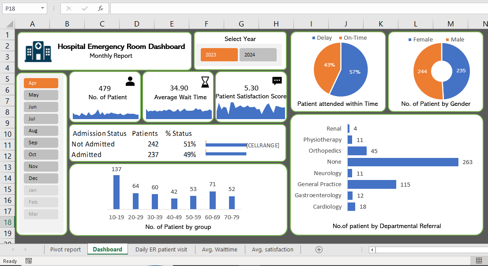

# Hospital Emergency Room Dashboard

An Excel-based interactive monthly report for tracking Emergency Room (ER)
patient volume, wait times, satisfaction, and admission outcomes, built on
pivot tables with year and month filtering.

## Dashboard Preview

## Purpose of the Project

We need to create a Hospital Emergency Room Analysis Dashboard in Excel
to improve efficiency and provide usefull insights. 
This dashboard will help stakeholders monitor, analyze, and make better
decision for managing patients and improving services.

## File

- `Hospital_Emergency_Room_Dashboard.xlsx` — Excel Workbook (Pivot Tables +
  Dashboard)

## Sheets

| Sheet | Description |
|---|---|
| **Dashboard** | Main interactive report — KPIs, charts, and filters described below |
| **Pivot report** | Underlying pivot tables powering the dashboard's charts and KPI cards |
| **Daily ER patient visit** | Day-by-day patient visit counts |
| **Avg. Waittime** | Day-by-day and yearly average patient wait time |
| **Avg. satisfaction** | Patient satisfaction score data |

## Analysis / What the Dashboard Shows

Based on the current view (April, 2023 data):

- **Headline KPIs**
  - **479** total number of patients
  - **34.90** average patient wait time (minutes)
  - **5.30** average patient satisfaction score

- **Patient attended within time** — Donut chart showing **57% On-Time**
  vs **43% Delay**, i.e. the share of patients seen within the expected
  time versus those delayed.

- **Patient by gender** — Donut chart showing a near-even split:
  **244 Female** vs **235 Male** patients.

- **Admission status** — 242 patients (51%) were **Not Admitted** and
  237 patients (49%) were **Admitted**, shown with patient counts and
  percentage share.

- **No. of patients by age group** — Bar chart across seven age bands
  (10-19 through 70-79), showing patient volume is highest in the
  **10-19** age group (137 patients) and drops off in older age bands
  (e.g. 42–71 patients in the 40-79 range).

- **No. of patients by departmental referral** — Bar chart of how many
  patients were referred to each department: **None (263)** is the
  largest group (no referral needed), followed by **General Practice
  (115)**, then smaller counts for Orthopedics (45), Cardiology (18),
  Gastroenterology (12), Neurology (11), Physiotherapy (11), and
  Renal (4).

- **Filters** — A **Year selector** (2023 / 2024) and a **Month selector**
  (Jan–Dec, with unavailable months grayed out) let you drill into the
  KPIs and charts for a specific month/year rather than viewing
  everything at once.

## Requirements

- Microsoft Excel (pivot tables and slicers/filters used throughout).

## Usage

1. Download `Hospital_Emergency_Room_Dashboard.xlsx`
2. Open in Excel
3. Use the **Year** buttons and **Month** list on the Dashboard sheet to
   filter all KPIs and charts to the period you want to review

## License
